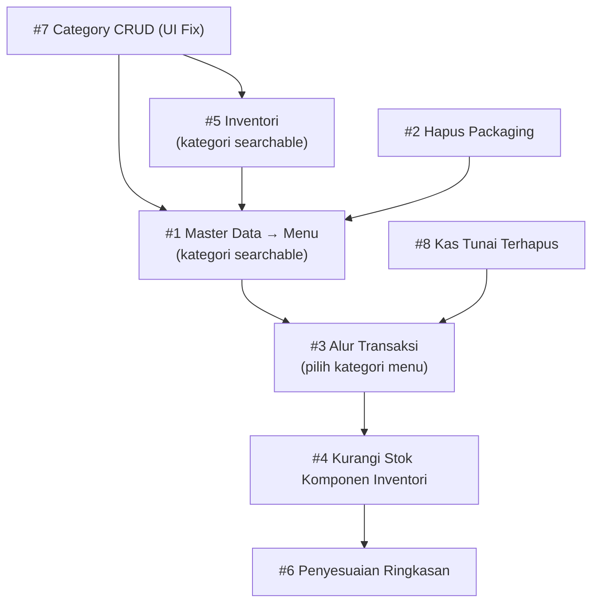

# Product Requirements Document (PRD)
## Meko Poin – Perubahan Fitur & Penyesuaian Sistem

**Versi:** 1.1 (Klarifikasi Diperbarui)  
**Tanggal:** 2026-08-13  
**Platform:** Flutter (Android, iOS, Desktop/Web)

---

## Latar Belakang

Aplikasi Meko Poin saat ini mengelola transaksi poin, inventori, master data produk/menu, kas, dan kategori. Berdasarkan kebutuhan operasional terbaru, diperlukan serangkaian perubahan struktural pada modul **Master Data**, **Inventori**, **Transaksi**, **Kategori**, dan **Ringkasan** agar alur kerja lebih sesuai dengan proses bisnis aktual.

---

## Tujuan

1. Mengubah konsep "Master Data" menjadi konsep **Menu** yang lebih intuitif, lengkap dengan komponen inventori.
2. Menyederhanakan form dengan menghapus fitur Packaging yang tidak lagi relevan.
3. Membuat alur transaksi yang lebih terstruktur: pilih kategori menu → pilih menu → tampil menu beserta komponen.
4. Memastikan transaksi hanya mengurangi stok komponen dari inventori (bukan master data langsung).
5. Merestrukturisasi inventori agar item unik berdasarkan nama dan kategori.
6. Menyesuaikan tampilan ringkasan/dashboard agar relevan dengan konsep baru.
7. Melengkapi fitur CRUD pada modul Kategori.
8. Memastikan kas tunai ikut terhapus ketika transaksi yang bersangkutan dihapus.

---

## Ruang Lingkup Perubahan

---

### 1. Master Data → Diubah Menjadi Menu

**Lokasi kode saat ini:**  
- Model: `lib/models/master_data.dart`  
- View: `lib/views/Dashboard/contents/masterdata_content.dart`  
- Form: `lib/views/Dashboard/components/form/master_data_form.dart`  
- Repository: `lib/services/master_data_repository.dart`

#### 1.1 Perubahan Penamaan & Konsep

| Kondisi Saat Ini | Kondisi Baru |
|---|---|
| Label "Master Data" | Label "Menu" |
| Field `isBundle`, `isCountable` | Konsep bundle tetap via kategori, tetapi UI lebih jelas |
| Field `packagingId` | **Dihapus** (lihat item #2) |

#### 1.2 Form Tambah/Edit Menu

Form wajib menampilkan field berikut:

| Field | Tipe | Keterangan |
|---|---|---|
| **Nama Menu** | Text Input (searchable/autocomplete) | Mendukung pencarian nama yang sudah ada atau mengetik nama baru |
| **Kategori Menu** | Searchable Dropdown + Tambah Baru | Tampil seperti pencarian, user bisa pilih dari daftar atau menambah kategori baru langsung dari field ini |
| **Harga** | Number Input | Harga jual menu dalam rupiah |
| **Daftar Komponen** | Multi-item list | Pilih kategori inventori → pilih item dari inventori, bisa tambah lebih dari satu komponen |

**Aturan Unikitas:**  
Item menu unik berdasarkan kombinasi **nama + kategori**. Sistem harus validasi dan tolak duplikasi pada kombinasi tersebut.

> [!IMPORTANT]
> Validasi unikitas saat ini hanya berdasarkan `name`. Logika `isNameAlreadyUsed()` di `master_data_repository.dart` harus diubah menjadi validasi `name + category_id`.

#### 1.3 Daftar Komponen (Bundle Items)

Setiap menu dapat memiliki daftar komponen yang diambil dari **inventori**:
- Pilih **kategori inventori** terlebih dahulu
- Lalu pilih **item inventori** berdasarkan kategori yang dipilih
- Tentukan **jumlah (qty)** komponen tersebut
- Komponen disimpan ke tabel `bundle_items` (model `BundleItem`)

---

### 2. Hapus Fitur Tambah/Edit Packaging

**Lokasi kode saat ini:**  
- Field `packagingId` di model `MasterData`  
- Field `packaging_id` di `masterdata` content dan repository

#### Perubahan:
- Hapus seluruh referensi `packagingId` / `packaging_id` dari:
  - Model `MasterData`
  - Form Master Data / Menu
  - Repository `master_data_repository.dart`
  - Content `masterdata_content.dart`
- Skema database perlu migrasi untuk menghapus kolom `packaging_id` dari tabel `master_data` (atau ditandai sebagai deprecated jika menggunakan soft migration)

> [!WARNING]
> Pastikan tidak ada referensi aktif ke `packaging_id` sebelum migration dijalankan.

---

### 3. Alur Transaksi – Pilih Kategori Menu → Pilih Menu → Tampil Komponen

**Lokasi kode saat ini:**  
- View: `lib/views/Dashboard/contents/transaksi_content.dart`  
- Form: `lib/views/Dashboard/components/form/transaction_form.dart`

#### Alur Baru:

```
[Buat Transaksi]
       ↓
[Pilih Kategori Menu]
       ↓
[Tampil daftar Menu dalam kategori tersebut]
       ↓
[Pilih Menu]
       ↓
[Tampil Menu yang dipilih beserta daftar komponen-komponennya]
       ↓
[Input jumlah / konfirmasi]
       ↓
[Submit Transaksi]
```

#### Detail UI:
- **Step 1 – Pilih Kategori Menu:** Tampilkan grid/list kategori menu yang tersedia
- **Step 2 – Pilih Menu:** Tampilkan menu yang ada dalam kategori terpilih
- **Step 3 – Review & Konfirmasi:** Tampilkan kartu menu beserta komponen-komponen yang akan digunakan (nama komponen, qty), harga, dan total

---

### 4. Transaksi Hanya Mengurangi Stok Komponen dari Inventori

**Lokasi kode saat ini:**  
- Repository: `lib/services/transaction_repository.dart`  
- Repository: `lib/services/inventory_repository.dart`

#### Perilaku Saat Ini:
Belum jelas apakah pengurangan stok sudah melalui `bundle_items` atau langsung ke `master_data`.

#### Perilaku Baru yang Diharapkan:
- Saat transaksi di-submit, sistem membaca daftar `bundle_items` dari setiap menu yang dibeli
- Untuk setiap komponen dalam `bundle_items`, kurangi stok pada tabel **inventori** sebesar `qty` × `jumlah menu yang dibeli`
- Log pengurangan stok harus dicatat di `inventory_log`
- Master data **tidak** dikurangi langsung; yang dikurangi adalah stok **inventori** terkait

> [!IMPORTANT]
> Ini adalah perubahan logika bisnis inti. Perlu audit menyeluruh pada `transaction_repository.dart` untuk memastikan alur pengurangan stok sudah benar.

---

### 5. Inventori – Perubahan Struktur Item

**Lokasi kode saat ini:**  
- Model: `lib/models/inventory.dart`  
- View: `lib/views/Dashboard/contents/inventory_content.dart`  
- Form: `lib/views/Dashboard/components/form/inventory_form.dart`  
- Repository: `lib/services/inventory_repository.dart`

#### 5.1 Perubahan Model Inventori

Saat ini inventori menggunakan `masterDataId` sebagai referensi. Konsep baru mengubah inventori menjadi entitas mandiri dengan field:

| Field | Tipe | Keterangan |
|---|---|---|
| **Nama** | Text (searchable) | Nama item inventori |
| **Kategori** | Searchable Dropdown + Tambah Baru | Pilih dari daftar atau tambah kategori baru langsung |
| **Stok** | Integer | Jumlah stok saat ini |

**Aturan Unikitas:**  
Item inventori unik berdasarkan kombinasi **nama + kategori**. Validasi duplikasi harus diterapkan di repository.

#### 5.2 Perubahan pada Form Inventori

Form harus menampilkan:
- Field **Nama** – input teks, bisa diketik atau dipilih dari nama yang sudah ada (autocomplete/searchable)
- Field **Kategori** – searchable dropdown, mendukung tambah kategori baru langsung dari field ini (tanpa pindah halaman)
- Field **Stok** – numeric input

> [!NOTE]
> "Tambah kategori baru" dari field kategori di form inventori harus menggunakan bottom sheet atau inline dialog yang memanggil `CategoryRepository.insertCategory()` tanpa menavigasi user keluar dari form.

#### 5.3 Relasi Inventori ke Master Data (Menu)

Setelah perubahan ini, relasi antara inventori dan menu adalah:
- Menu memiliki daftar komponen (`bundle_items`)
- Setiap komponen dalam `bundle_items` mereferensikan ID inventori (bukan master data)
- Model `BundleItem.componentMasterDataId` perlu dipertimbangkan apakah perlu diubah menjadi `inventoryId`

> [!IMPORTANT]
> Keputusan desain: apakah `bundle_items` mengacu ke tabel `inventory` secara langsung, atau tetap melalui `master_data` dengan `master_data` yang merepresentasikan item bahan baku? Perlu klarifikasi sebelum implementasi.

---

### 6. Penyesuaian Ringkasan (Dashboard)

**Lokasi kode saat ini:**  
- View: `lib/views/Dashboard/contents/ringkasan_content.dart`  
- Cards: `lib/views/Dashboard/components/card/`

#### Perubahan yang Diperlukan:

Dengan konsep baru (menu + komponen dari inventori), beberapa kartu ringkasan perlu disesuaikan:

| Kartu | Kondisi Saat Ini | Penyesuaian |
|---|---|---|
| `CardKertasTerjual` | Berdasarkan kategori "kertas" dari master data | Sesuaikan ke kategori inventori "kertas" |
| `CardPlastikTerjual` | Berdasarkan kategori "plastik" dari master data | Sesuaikan ke kategori inventori "plastik" |
| `CardGudang` | Berdasarkan inventory log | Pastikan log berasal dari transaksi menu via komponen |
| `CardProduk` | Berdasarkan data transaksi | Review relevansi dengan konsep baru |
| `CardProdukTerjual` | Berdasarkan master data + transaction item | Perlu review apakah masih relevan |

---

### 7. Kategori – Lengkapi CRUD

**Lokasi kode saat ini:**  
- View: `lib/views/Dashboard/contents/category_content.dart`  
- Repository: `lib/services/category_repository.dart`

#### Kondisi Saat Ini:
- Form tambah kategori: ✅ Ada  
- Form edit kategori: ✅ Ada (via `_openForm(category)`)  
- Hapus kategori (soft delete): ✅ Ada  
- **Tombol Edit & Hapus di tabel daftar kategori: ❌ Belum tampil di UI (tidak ada action button di `ListTile`)**

#### Perubahan:

Tambahkan tombol **Edit** dan **Hapus** pada setiap baris di daftar kategori:

```
[Nama Kategori] [code | bundle | countable]    [✏️ Edit] [🗑️ Hapus]
```

- Tombol **Edit** → navigasi ke form edit yang sudah ada
- Tombol **Hapus** → tampilkan konfirmasi dialog yang sudah ada (`_deleteCategory`)

> [!NOTE]
> Implementasi sudah sebagian besar selesai di backend. Hanya perlu menambahkan tombol aksi di `_buildTable()` pada `category_content.dart`.

---

### 8. Kas Tunai Ikut Terhapus saat Transaksi Dihapus

**Lokasi kode saat ini:**  
- Repository: `lib/services/transaction_repository.dart`  
- Repository: `lib/services/kas_repository.dart`  
- Model: `lib/models/kas.dart` (mendukung `deletedAt` untuk soft delete)

#### Perilaku Saat Ini:
Ketika transaksi dihapus, kas tunai yang terkait dengan transaksi tersebut **tidak** ikut terhapus secara otomatis.

#### Perilaku Baru:
- Saat transaksi dengan `paymentMethod == 'tunai'` (atau metode kas) dihapus, sistem harus:
  1. Menemukan entri `kas` yang terkait dengan `transaction_id` tersebut
  2. Melakukan soft delete pada entri kas terkait (set `deleted_at`)

#### Syarat Implementasi:
- Model `Kas` sudah memiliki `deletedAt` – tinggal memastikan ada relasi atau referensi `transaction_id` di tabel `kas`
- Jika tabel `kas` belum memiliki kolom `transaction_id`, perlu ditambahkan via migrasi database
- Operasi penghapusan kas harus dilakukan dalam **satu transaksi database** bersama penghapusan transaksi (atomic operation)

> [!CAUTION]
> Pastikan operasi ini bersifat **atomic** – jika penghapusan kas gagal, penghapusan transaksi juga harus di-rollback untuk menghindari inkonsistensi data.

---

## Ketergantungan Antar Perubahan



**Urutan implementasi yang disarankan:**

1. `#2` – Hapus Packaging (perubahan model, tidak ada dependensi)
2. `#7` – Lengkapi CRUD Kategori di UI
3. `#5` – Restrukturisasi Inventori (nama + kategori, unikitas baru)
4. `#1` – Ubah Master Data menjadi Menu (dengan komponen dari inventori)
5. `#3` – Ubah Alur Form Transaksi
6. `#4` – Pastikan logika pengurangan stok hanya dari komponen inventori
7. `#8` – Kas tunai ikut terhapus saat transaksi dihapus
8. `#6` – Sesuaikan Ringkasan/Dashboard

---

## Pertanyaan Terbuka / Klarifikasi Dibutuhkan

## Klarifikasi Telah Diselesaikan

| # | Pertanyaan | Jawaban |
|---|---|---|
| Q1 | Relasi `BundleItem` ke Inventori | **Mereferensikan tabel `inventory` langsung** (bukan via `master_data`) → field `component_master_data_id` di `Data_Bundle_Item` harus diubah menjadi `component_inventory_id` |
| Q2 | Definisi "Kas Tunai" yang ikut terhapus | **Semua jenis kas** (bukan hanya `cash`). Dan hasil audit kode: tabel `Data_Kas` **belum punya kolom `transaction_id`** → perlu ditambahkan via database migration (versi 9) |
| Q3 | Tabel Kategori (Inventori vs. Menu) | **Satu tabel `Data_Category` yang sama** digunakan untuk kedua keperluan |
| Q4 | Desain widget Kategori Searchable | **Inline dropdown** – tampil di bawah field input tanpa berpindah halaman |

### Temuan Audit Kode (Kas)

Dari [`database_helper.dart`](file:///c:/Users/USER/Documents/projects/meko-poin/lib/services/database_helper.dart#L283-L299):

```sql
CREATE TABLE Data_Kas (
  id INTEGER PRIMARY KEY AUTOINCREMENT,
  amount INTEGER,
  description TEXT,
  type TEXT CHECK(type IN ('income', 'outcome')),
  cash_date DATE,
  -- TIDAK ADA transaction_id di sini
  created_by INTEGER,
  updated_by INTEGER,
  deleted_by INTEGER
)
```

> [!CAUTION]
> **Tabel `Data_Kas` belum memiliki kolom `transaction_id`.** Perlu ditambahkan via database upgrade ke **versi 9** menggunakan `_addColumnIfNotExists()`. Kolom ini akan menjadi nullable karena kas manual (non-transaksi) tidak punya `transaction_id`.

### Temuan Audit Kode (Bundle Item)

Dari [`database_helper.dart`](file:///c:/Users/USER/Documents/projects/meko-poin/lib/services/database_helper.dart#L301-L321):

```sql
CREATE TABLE Data_Bundle_Item (
  component_master_data_id INTEGER NOT NULL,
  -- Saat ini FK ke Data_Master, harus diubah ke Data_Inventory
  FOREIGN KEY (component_master_data_id) REFERENCES Data_Master(id)
)
```

> [!CAUTION]
> **Tabel `Data_Bundle_Item` harus dimigrasi.** Kolom `component_master_data_id` harus diubah menjadi `component_inventory_id` dengan FK ke `Data_Inventory(id)`. Karena SQLite tidak mendukung `ALTER COLUMN`, harus menggunakan strategi **recreate table** (sama seperti pola `_removeCategoryCheckConstraint` yang sudah ada).

---

## Kriteria Penerimaan (Acceptance Criteria)

| # | Fitur | Kriteria |
|---|---|---|
| 1 | Menu – Form | Form menampilkan nama, kategori (searchable+tambah baru), harga, dan daftar komponen |
| 1 | Menu – Unikitas | Sistem menolak duplikasi berdasarkan nama + kategori |
| 2 | Hapus Packaging | Tidak ada field/referensi packaging di UI dan form menu |
| 3 | Transaksi – Alur | User bisa memilih kategori → menu → review komponen sebelum submit |
| 4 | Transaksi – Stok | Stok yang berkurang hanya dari inventori melalui bundle_items |
| 5 | Inventori – Form | Form menampilkan nama (searchable), kategori (searchable+tambah baru), stok |
| 5 | Inventori – Unikitas | Sistem menolak duplikasi berdasarkan nama + kategori |
| 6 | Ringkasan | Kartu-kartu ringkasan menampilkan data yang relevan dengan konsep baru |
| 7 | Kategori CRUD | Tombol Edit dan Hapus tampil dan berfungsi di daftar kategori |
| 8 | Kas Tunai | Kas tunai terhapus (soft delete) otomatis ketika transaksi terkait dihapus |